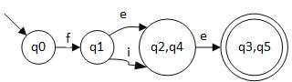

# 词法分析

<!-- vim-markdown-toc GitLab -->

* [编译器阶段](#编译器阶段)
* [词法分析器](#词法分析器)
	* [从字符流到记号流](#从字符流到记号流)
	* [记号的数据结构定义](#记号的数据结构定义)
* [词法分析器的手工编码实现](#词法分析器的手工编码实现)
	* [两种实现方法](#两种实现方法)
	* [转移图](#转移图)
* [词法分析器自动生成](#词法分析器自动生成)
	* [正则表达式RE](#正则表达式re)
	* [有限状态自动机FA](#有限状态自动机fa)
	* [RE -> NFA: Thompson算法](#re-nfa-thompson算法)
	* [NFA -> DFA: 子集构造算法](#nfa-dfa-子集构造算法)
* [DFA的最小化: Hopcroft最小化算法](#dfa的最小化-hopcroft最小化算法)
* [从DFA生成分析算法](#从dfa生成分析算法)
	* [转移表](#转移表)
	* [跳转表](#跳转表)

<!-- vim-markdown-toc -->

## 编译器阶段


前端：


## 词法分析器

### 从字符流到记号流

一段c源程序如下

```cpp
if (x > 5) //这里有\n回车
	y = "hello";
else
	z = 1; //EOF
```

词法分析器将这段c源程序切分为一个个单词，空格被扔掉。
这里，字符串`"hello"`作为一个整体，两个引号和hello不会被切分。
切分之后得到记号/单词流

```bash
if lparen ident(x) gt int(5) rparen
	ident(y) assign string("hello") semicolon
else
	ident(z) assign int(1) semicolon eof
```

从字符流到记号流有两个重要问题要解决：

1. 记号数据结构的定义
2. 字符流转化为记号流的算法

### 记号的数据结构定义

如用C实现

```cpp
enum kind {IF, LPAREN, ID, INTLIT, ...}; //一个名为kind的枚举类型
//从IF开始，所有类型的值被编码为一个整型数0,1,2,3...是对词法分析器所能实现的所有类型的值的分类
struct token{
	enum kind k;
	char *lexeme; //所识别出的单词的具体的值,如果为0代表未赋任何值
};

```

例如, `if (x > 5)`,所对应的token的伪代码是

```cpp
token{k=IF, lexeme=0};
token{k=LPAREN, lexeme=0};
token{k=ID, lexeme="x"};
...
```

## 词法分析器的手工编码实现

### 两种实现方法
1. 手工编码 (gcc, LLVM ...)
2. 词法分析器的生成器(可快速原型, 代码量较少； 但较难控制细节)

### 转移图

如有关系运算符: <=, <>, <, =, >=, >
数字n代表n号状态，*代表字符回滚


转移图算法如下

```cpp
token nextToke(){
	c = getChar();
	switch(c){
		case '<' : {
			c = getChar();
			switch(c){
				case '=' : return LE;
				case '>' : return NE;
				default : {rollback(); return LT;}
			}
			case '=' : return EQ;
			case '>' : ...//similar
		}
	}
}
```

标识符(ID)的转移图/算法类似


***
标识符和关键字？
很多语言中，标识符和关键字有交集。从词法分析的角度看，关键字是标识符的一部分。

如，以c语言为例，关键字也满足标识符的词法规则<font color="grey">以字母或下划线开头，后跟0个或多个字母，下划线或数字</font>。
所以，识别关键字可以在识别标识符的基础上增添特殊情况。


关键字识别还有一种算法：关键字表算法

1. 对给定语言中所有的关键字，构造关键字构成的哈希表H <font color="grey">关键字是有限的，确定的</font>
2. 对所有的标识符和关键字，先按统一标识符的转移图进行识别
3. 识别完成后，进一步查表H看是否是关键字

哈希表的作用是，让查表操作快速完成。通过合理地构造哈希表(完美哈希)，可以在O(1)时间完成。
***

## 词法分析器自动生成

声明式的规范 -> 自动生成工具(如lex, flex, jlex) -> 词法分析器

这样，就把写代码的工作化简为写声明式的规范，即正则表达式。

### 正则表达式RE
定义：

字符集取决于要编译的语言，如c语言，字符集为ascii; java, 字符集为unicode.
闭包(Kleene 闭包)是一元算符，MM用了连接。

例子：用正则表达式表示c语言中的标识符
`(a|b|c|...|A|B|...|Z|_)(a|b|c|...|A|B|...|Z|_|0|1|...|9)*`

***
**语法糖 Syntactic sugar**
引入*语法糖*，简化构造

```
[c1-cn] == c1|c2|...|cn
e+ == 一个或多个e
e? == 零个或一个e
"a*" == a*自身，不是a的Kleen闭包
e{i,j} == i到j个e的连接
. == 除'\n'外的任意字符

实际上，所有的运算都可用**赋值**和**跳转**完成(汇编)。高级语言的语法实际上都是语法糖。是对这两种运算的不同封装，以方便代码的开发和维护。
```

***

### 有限状态自动机FA

用来描述生成的状态。

输入的字符串 -> FA -> {Yes, No}
是否能识别输入的字符串，若能，输出Yes; 否则，输出No

可用五元组M描述有限状态自动机FA

字母表是能识别的字符的集合。
状态集指有FA的状态。
转移函数描述了自动机在给定串的驱动下是如何工作的。(wiki: 转移函数是用来拟合或描述黑箱模型（系统）的输入与输出之间关系的数学表示。)

一个确定有限状态自动机**DFA**(<font color="green">对所有状态，对于给定字符，状态转移是单元素的集合</font>)的例子


Σ = {a, b}
S = {0, 1, 2}
q0 = 0 <font color="green">起始状态，图上有单项箭头指向的状态</font>
F =  {2} <font color="green">终结/接受状态，是集合，图上有双圈的状态</font>

转移函数：

```
{(q0,a)->q1, (q0,b)->q0,
(q1,a)->q2, (q1,b)->q1,
(q2,a)->q2,(q2,b)->q2}
```

一个非确定有限状态自动机的例子**NFA**

转移函数：

```
{(q0,a)->{q0,q1},
(q0,b)->{q1},
(q1,b)->{q0,q1}}
```

对于NFA来说，对于给定的串，只要某一中走法能到终结状态，就说该串能被**接受**。
所以在NFA上是否能接受，需要遍历的过程。所以，经常把NFA转化为与其等价的DFA，方便判断。
词法分析器是DFA

RE -(Thompson算法)-> NFA -(子集构造算法)-> DFA -(Hopcroft最小优化算法)-> 词法分析器代码

### RE -> NFA: Thompson算法

**Thompson算法**

Thompson算法是基于归纳的算法：

- 对于基本的RE(2种)直接构造
- 对于符合的RE(3种)递归构造

RE:(5种)

```
(1) e -> ε
(2) -> c
(3) -> e1 e2
(4) -> e1 | e2
(5) -> e1*
```


例子：`((ab)|c)*`


### NFA -> DFA: 子集构造算法

`a(b|c)*`

对应的NFA：


要构造与其等价的**DFA**(不包括ε边)：

> 1. n0 -(a)->n1</br> n0 -(a)->n1,n2,n3,n4,n6,n9 </br><font color="green">n0读入字符a，所能走到的所有节点。将其记为集合q1:{n1,n2,n3,n4,n6,n9}。由于读入a后，可以走到这些节点，所以把q1叫做一个边界。将n0记为q0.</font>
>2. q1 -(b <font color="green">考虑q1中所有节点是否可以接受b</font>)->n5  <font color="blue">在原来的NFA上看接受一个字符b后能做到哪些节点，该操作记为delta(q)</font> </br> q1 -(b)-> q2:{n5,n8,n9,n3,n4,n6} <font color="blue">在进行了delta(q)操作后，对与每个元素求ε边界，该过程称为ε-闭包</font>
>3. q2 -> {...}
> <font color="green">由于原NFA中n9为接受状态，所以在新的DFA中，有n9的都是接受状态。</font>

子集构造算法是**不动点算法(fixed point algorithm)**。
时间复杂度最坏情况 O(2^N),但是在实际中不常发生，因为并不是每个子集都会出现。

-----

ε-闭包的计算：基于**深度优先遍历**的算法(伪代码)
经过delta转化之后达到边界，但是还要读入ε,找到ε边界。所有这些节点构成其ε闭包。    

```cpp
set closure = {}; //闭包，一开始是空集

void eps_closure (x) //计算x的闭包
	closure += {x} //把x元素并到集合中
	forsearch (y : x--ε--> y) //对满足条件的y循环
		if (!visited(y))
			eps_closure (y) //递归地去计算y的闭包
```

基于宽度优先的算法

```cpp
set closure = {};
Q = []; //queue
void eps-closure (x) =
	Q = [x];
	while (Q not empty)
		q <- deQueue (Q)
		closure += q
		forsearch(y: q--ε--> y)
			if (!visited(y))
				enQueue(Q, y) //q的所有后继节点y如果没有访问过，入队
```

-----

子集构造算法：工作表算法 结合例子a(b|c)*

```cpp
q0 <- eps-closure (n0) //  eps-closure()计算ε闭包
	Q <- {q0} //Q是DFA中所有的状态机
	workList <- q0 //Queue
	while (workList != [])
		remove q from workList //从workList中取出q
		foreach (character c) //对每一个字符c都要讨论e.g.若是ascii,则循环256遍
			t <- eps-closure (delta(q, c)) //先作delta转换，然后计算其e-closure
			D[q, c] <- t //D[]标记DFA中的状态转换，由q读入字符c到达t
			if (t not in Q)
				add t to Q and workList
```

## DFA的最小化: Hopcroft最小化算法

对于DFA的各种状态，有的状态可以相互合并。状态和边越少，占用的计算资源越少。

```cpp
//基于等价类的思想
split(S)
    foreach(character c)
        if(c can split s)
            split s into T1, ..., Tk

hopcroft()
    split all nodes into N, A
    while(set is still changes)
        split(s)
```
Hopsroft 算法先根据非终结状态与非终结状态将所有的节点分为 N 和 A 两大类。 N 为非终结状态，A 为终结状态，之后再对每一组运用基于等价类实现的切割算法。不断切割，直到不能切割。


q1,q2,q3 都有对状态 a 的转移，但是 q1 和 q2 转移到了同样的一个状态 S2, q3 转移到了 S3。所以 q1,q2 可以看做一组，因为它们对 a 的行为是一致的，都到了 S2。q3 单独一组。所以 a 这个字符将 S1 切为了两个子集。这就是等价类的思想。

例子
对于其DFA


N是q0,A是{q1,q2,q3}
在A中，字符b,c的状态转移，每个节点最后得到的都还是A这个状态，无法对q1,q2,q3进行区分。所以就将这三个节点融合为一个新的节点q4。


例子

1. N:{q0,q1,q2,q4}
A:{q3,q5}
2. 在N中q0和q1 在接受字符的条件下最终得到的状态还是在 N 的内部，但是q2和q4接受e的条件下得到的状态是A。所以可以将其根据e拆分成{q0,q1},{q2,q4},{q3,q5}
3. 对于q2和q4都可以接受e，而且最终达到的状态一致，所以不能再进行切分
4. q0和q1，在接受字符后q0最终得到还是在 {q0,q1} 这个状态的集合中，q1 却会落在{q2,q4}中，所以可以将 q0 和 q1 分为 {q0},{q1}。

综上



## 从DFA生成分析算法

### 转移表

DFA是一个有向图，可以用转移表，哈希表，跳转表等方式表示。

如对于` a(b|c)*`最小化后的DFA


可以将它编码成表

|状态\接受字符|a|b|c|
|----|----|----|----|
|0|1|||
|1||1|1|

该表的实现为

```cpp
char table[M][N];

table[0]['a'] = 1;
table[1]['b'] = 1;
table[1]['c'] = 1;
//other table entries
//are ERROR
```

驱动代码

```cpp
nextToken()
    state = 0 //最初，为起始状态0
    stack = [] //栈为空

	//不断地寻找最长的匹配字符串
	while(state != ERROR) //在上面的表格中表示不为空
        c = getChar()
        if(state is ACCEPT)  // 接受状态,q1； 表格中表示为状态1，有（1,b）, (1,c)
            clear(stack) //若是接受状态，清空栈
        push(state) //当前状态压栈
        state = table[state][c] //当前状态更新为接受字符后的状态

	//实现在下一个终结状态匹配失败的时候能够实现回滚到上一各终结状态，实现捕捉到能够匹配的最长字符串。
	while(state is not ACCEPT)
        state = pop()
        rollback()
```

-----

**最长匹配**

对于一个给定的字符串，默认寻找最长的匹配字符串。

例如某语言中有关键字是其他关键字的前缀, if和ifif
这里两个接受f后的状态都是终结状态，对于字符串ifif来说，要匹配到接受第二个f的终结状态。

例如，对于ifii，会在第四个字符匹配出现ERROE，退出第一个循环，进入第二个循环进行回滚操作，最终匹配为if。

------

### 跳转表


|状态\接受字符|a|b|c|
|----|----|----|----|
|0|1|||
|1||1|1|

(依旧是这个表)

构建代码

```cpp
nextToken()
    state = 0
    stack = []
    goto q0
q0:
    c = getChar()
    if(state is ACCEPT)
        clear(stack)
    push(state)
    if(c == 'a')
        goto q1
q1:
    c = getChar()
    if(state id ACCEPT)
        clear(stack)
    push(state)
    if(c == 'b' || c == 'c')
        goto q1
```

跳转表指定了转换的字符，可以提高转移的效率
