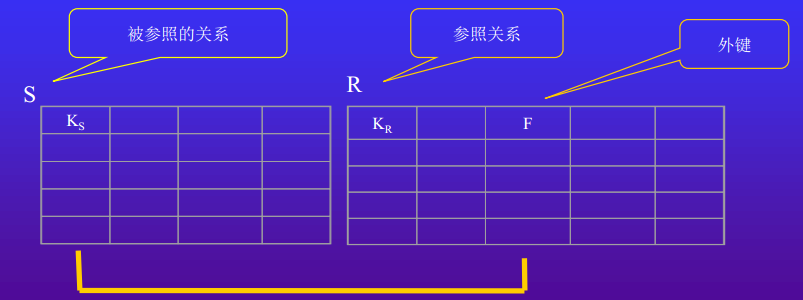

# SQL数据库

<!-- vim-markdown-toc GFM -->

* [数据管理技术](#数据管理技术)
	* [发展阶段](#发展阶段)
	* [数据库模型发展历史](#数据库模型发展历史)
	* [程序与数据的独立性](#程序与数据的独立性)
	* [DBMS](#dbms)
	* [DBS结构](#dbs结构)
	* [DBS组成成分](#dbs组成成分)
* [关系数据模型](#关系数据模型)
	* [基本概念](#基本概念)
	* [关系模型详解](#关系模型详解)
	* [笛卡尔积](#笛卡尔积)
* [关系的完整性约束](#关系的完整性约束)
	* [完整性约束条件分类](#完整性约束条件分类)
	* [关系的性质](#关系的性质)
	* [完整性约束规则](#完整性约束规则)
		* [第一范式规则](#第一范式规则)
		* [基于内容存取规则](#基于内容存取规则)
		* [行唯一性规则](#行唯一性规则)
		* [实体(行)完整性规则](#实体行完整性规则)
		* [参照完整性规则](#参照完整性规则)
* [关系代数](#关系代数)
	* [集合运算](#集合运算)
	* [关系运算](#关系运算)
* [SQL语言](#sql语言)

<!-- vim-markdown-toc -->

## 数据管理技术

### 发展阶段

1. 人工管理阶段
2. 文件系统阶段
3. 电子表格阶段
4. 数据库系统阶段

### 数据库模型发展历史

1. 层次模型：把数据组织成一棵根在上，叶在下的有向树
2. 网状模型：把数据组织成无环有向图
2. 关系模型：把数据组织成表间有冗余列的表
3. 对象-关系模型：用对象的方法组织数据

### 程序与数据的独立性

- 逻辑独立性：应用程序与数据库的逻辑结构相互独立
- 物理独立性：应用程序与存储在磁盘上的数据库中的数据相互独立


- 外模式/模式:逻辑独立性
- 模式/内模式:物理独立性

### DBMS

Database Management System, DBMS提供4方面数据控制功能：

1. Security: 数据的安全性保护
2. Integrity: 数据的完整性检查
3. Concurrency: 并发控制
4. Recovery: 数据库恢复

### DBS结构
DBS(Database System)包括：

1. DB(Database)
2. DBMS
3. AP(Applicatio Programs)

### DBS组成成分

1. 硬件：内存，外存，数据传输率
2. DB
3. 软件：OS，DBMS，以DBMS为核心的应用开发工具，高级语言+编译系统，数据库应用系统
4. 人：数据库管理员，应用程序员，最终用户(临时用户:<font color="grey">用SQL访问DBMS</font></br>初级用户:<font color="grey">用菜单访问DBMS</font>)

## 关系数据模型

### 基本概念

数据模型(Data Model)：是用来**抽象,表示和处理**现实世界中的数据和信息的工具。

数据模型三要求：

- 能比较真实地模拟现实世界
- 容易为人所理解(对用户)
- 便于在计算机上实现(对开发者)

***
对比：
数据结构的三要素：

- 逻辑结构：对数据间关系的描述， 与数据的存储无关， 独立于计算机
- 运算：定义在数据的逻辑结构上， 具体实现在存储结构上的操作要求
- 存储结构：逻辑结构在计算机存储器里的实现， 依赖于计算机
***

数据库的数据模型的三要素(关系模型三要素)：

- 数据结构
- 数据操作
- 数据完整性约束


### 关系模型详解
关系数据库建立在关系模型上，关系模型的本质是若干个二维表。


----

**数据库各部分术语**

- 标题/关系模式(heading of a table)： 组成关系的属性名的集合
- 数据库模式(database schema): 数据库的所有关系模式的集合
- 关系的内容： 关系中的元组集合
- 关系的基数(cardinality):关系中元组(行)个数
- 关系的度(degree): 关系中的属性(列)个数
- 域(domains)：属性的取值范围。DBS通过属性的数据类型支持域。</br><font color="grey">当定义一个表的时候，会为每个列指派一种数据类型（如字符型或者是整型），这些数据类型提供了一个广泛域。SQL-92标准引入了用户自定义域的概念。数据库管理系统将不会保存那些违背约束的数据信息。</font>

----

### 笛卡尔积

有集合A，B `A = {0,1}     B = {2,3,4}`
A×B和B×A的结果是两个集合相乘的笛卡尔积
```
A×B = {（0，2），（1，2），（0，3），（1，3），（0，4），（1，4）}；
B×A = {（2，0），（2，1），（3，0），（3，1），（4，0），（4，1）}；
```

1. 笛卡尔积不满足交换率，既 A×B ≠ B×A
2. 两个集合笛卡尔积得到的新集合的元素个数是： A集合的元素个数 × B集合的元素个数
3. AxB是有（0，2），BxA是有（2，0）

## 关系的完整性约束

关系完整性约束： 关系模型中的一些规则，告诉我们在表结构中哪些变化是允许的，哪些检索操作是受限的。

完整性约束条件： 加在数据库数据之上的语义约束条件。

### 完整性约束条件分类


### 关系的性质

1. 关系名唯一
2. 属性名唯一
3. 属性的顺序并不重要
4. 理论上来说， 元组的顺序不重要（但实际上，这个顺序将影响对元组的访问效率）
5. 单值属性：关系的分量仅包含一个原子（单一）值
6. 非结构属性：同一属性中的各个值都取自相同的域
7. 元组唯一：各个元组互不相同，不存在重复的元组

### 完整性约束规则

#### 第一范式规则

在定义的表中,关系模型坚持**不允许**含有**多值属性**(有时称为重复字段)和含有**内部结构**(比如记录类型)的列

#### 基于内容存取规则

基于内容存取行。
数学上的合理性：行是没有次序的。

#### 行唯一性规则

关系中任何两个元组(表中的行)的值在同一时刻不能是完全相同的

#### 实体(行)完整性规则

表T中的任意行在主键列的取值都不允许为空

----

**基本概念**

超键: 超键是能唯一区分任意两行数据的列或多个列

键(key, candidate key):给定一个表T， 标题Head(T)=A1…An。 表T的一个键， 有时也称为候选键， 是具有以下两个特征的一组属性的集合K=Ai1…Aik:

2. 1. 如果u,v是T中两个不同的元组， 则u[K]≠v[K];
2. 没有K的真子集H具有特征1）

<font color="grey">键具有唯一标识性。键是**最小**超键。</font>

主键： 被数据库设计者选择出来作为表T的行的唯一性标识符的候选键

<font color="grey">键是客观的概念， 主键是主观的概念.</font>

空值(NULL Value): 未知的或者尚未定义的值

----

#### 参照完整性规则

外键(Foreign key):设F是基本关系R的一个或一组属性，但不是R的键。如果F与基本关系S的键KS相对应，则称F是R的外键（Foreign Key），并称R为参照关系(Referencing Relation），S 为 被 参 照 关 系（Referenced Relation）。关系R和S不一定是不同的关系。


若属性（或属性组）F是基本关系R的外键，它与基本关系S的键KS相对应（关系R和S不一定是不同的关系），则对于R中每个元组在F上的值必须为：
1. 或者取空值（F的每个属性值均为空值）
2. 或者等于S中某个元组的主键值。

参照完整性规则用冗余属性描述了实体之间的关系，只允许外键这一种冗余属性的存在，其他尽量不允许。

例如，学生关系数据库：

```
学生(学号，姓名，借书卡号，年龄，所在院系)
课程(课程号，课程名，学分)
选修(学号，课程号，成绩)
```

中三个**关系**之间存在**属性**间的引用, 选修关系引用了学生关系的主键"学号"和课程关系的主键"课程号"。
显然，选修关系中的"学号"值必须是学生关系中实际存在的"学号"。
选修关系中的"课程号"必须是课程关系中实际存在的"课程号"。
这就满足了参照完整性规则(2), 它说明, 选修关系中的某些属性("学号","课程号")需要参照学生关系及课程关系对应的属性内容取值。
所以, 选修关系被称为依赖表/参照关系, 学生关系和课程关系被称为目标表/被参照关系。

## 关系代数

关系代数是一种抽象语言, 它通过对关系的运算来表达查询。关系代数以关系为运算对象，通过对关系进行"组合"或"分割", 得到所需的数据集合--一个新的关系。

关系代数可分为:
1. 集合运算(并, 交, 差, 广义笛卡儿积) <font color="blue">以行为元素进行</font>
2. 关系运算(投影, 选择, 连接, 除运算) <font color="blue">不仅涉及行, 而且涉及列</font>
3. 扩充的关系运算(广义投影, 外连接, 半连接, 聚集 等)

关系代数常用的运算符:


### 集合运算

设:t为元组变量; R, S为同类的n元关系。
<font color="red">同类: 两个关系有相同的列数(元),且相应的属性值取自同一个域(数姓名可以不相同)</font>

- 并(Union): R∪ S={t|t∈ R ∨ t∈ S}
- 差(Difference): R-S={t|t∈ R ∧ t∉ S}
- 交(Intersection): R∩ S={t|t∈ R ∧ t∈ S}
- 积(Cartesian Product, 广义笛卡尔积):<font color="blue">R为k1元关系, 有n1个元组。S为k2元关系, 有n2个元组。广义笛卡儿积的结果为k1+k2元新关系, 有n1×n2个元组。每个元组由R的一个元组(前k1列)与S的一个元组(后k2列)拼接而成。</font></br>R×S={tr ts|(tr∈ R)∧(ts∈ S)}


### 关系运算

- 选择(Selection): </br> <font color="blue">挑出满足条件F的元组。</font>
- 投影(Projection): </br> <font color="blue">列上进行选择。R中取属性名表A中制定的列。</font>
- 连接(Join):</br><font color="blue">从R×S中选取R在A属性组上的值与S在B属性组上满足θ关系的元组，构成一个新关系。</font></br>
- 除(Division): 


## SQL语言

SQL语言格式约定：
- SQL是一种自由格式语言：它对每一行的字符数不作限定，也不要求一个SQL语句一定分成几行来写
- SQL的编译器不区分大小写；（字符常量除外）
- 以分号结束语句

如何增强SQL语句的可读性?
1. 用分行、 对齐和缩进方法
- 分行：语句的每一个子句在新的一行开始书写
- 对齐：每一子句与其它子句的开始处在同一列上
- 缩进：如果子句由几个部分组成， 则它们应当出现在不同的行,并在子句开始处使用缩进方式表示这种关系
2. SQL的保留字使用大写

用扩展的巴克斯范式(Backus Naur Form, BNF)定义SQL语句
1. 大写字母用于表示保留字
2. 小写字母用于表示用户自定义字
3. 竖线( | )用于表示从选项中进行选择
4. 大括号( { } )用于表示所需元素
5. 中括号( [ ] )用于表示可选择元素
6. 省略号( … )用于表示选择项可重复0到多次
