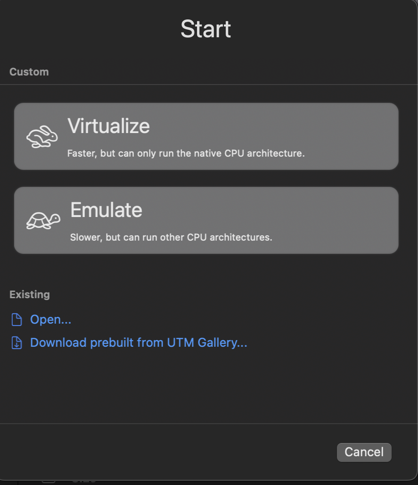
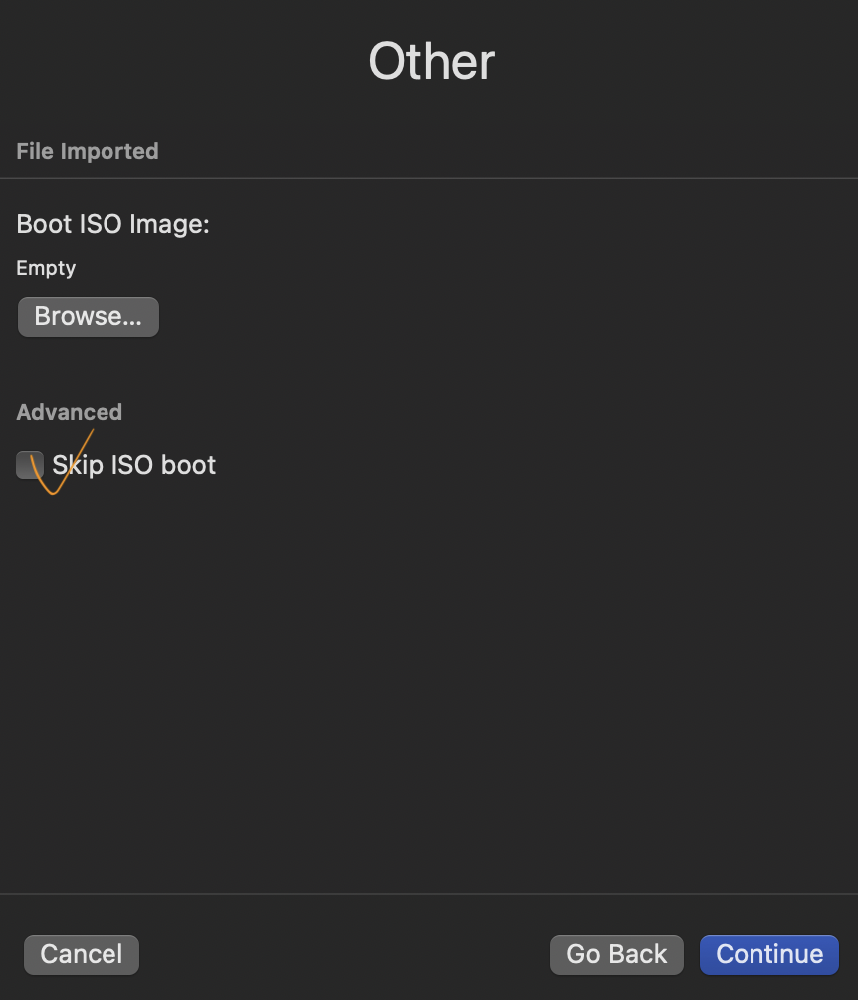
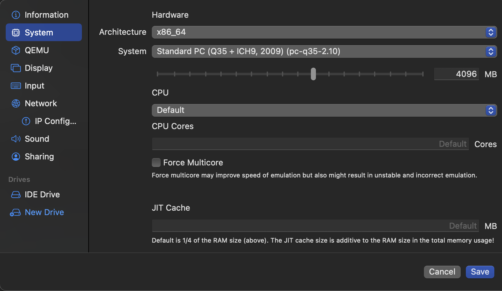
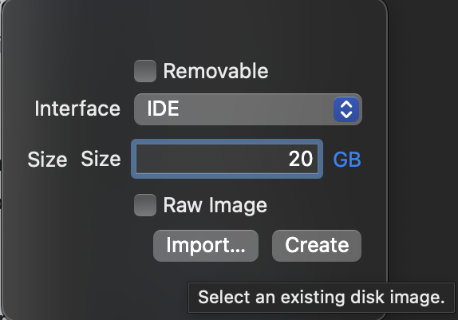
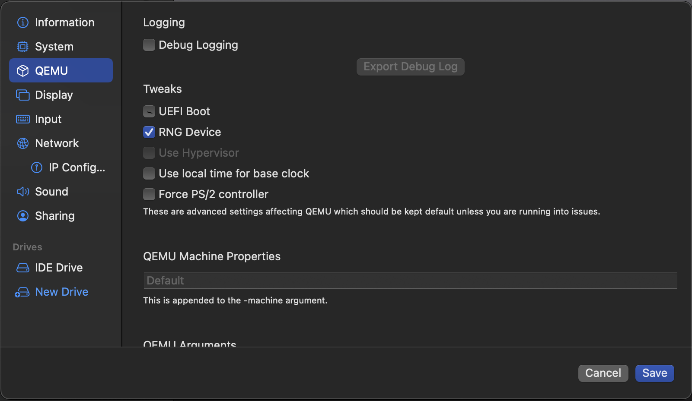

# Use UTM with OS X


<!-- vim-markdown-toc GFM -->

* [SSH Into UTM VM](#ssh-into-utm-vm)
* [Change disk image size](#change-disk-image-size)
* [Install Kali Virtual Machine With UTM](#install-kali-virtual-machine-with-utm)
    * [Black Screen Issue](#black-screen-issue)
    * [Environment](#environment)
    * [Install Kali Virtual Machine With UTM](#install-kali-virtual-machine-with-utm-1)
    * [SPICE Guest Tools](#spice-guest-tools)
    * [Trouble Shooting](#trouble-shooting)
        * [Failed to save VM snapshot](#failed-to-save-vm-snapshot)
* [x86 Emulation](#x86-emulation)
    * [Emulation Instead of Simulation](#emulation-instead-of-simulation)
    * [Convert VMDK Image to QCOW2 format](#convert-vmdk-image-to-qcow2-format)
    * [Use QCOW2 on UTM](#use-qcow2-on-utm)

<!-- vim-markdown-toc -->

## SSH Into UTM VM

[ref](https://github.com/utmapp/UTM/discussions/2465)

Set up the VM to `Shared Network`, then you can reach the VM via its ethernet IP.

1. Install ssh server on VM(e.g. Ubuntu VM here): `sudo apt install openssh-server`

2. SSH command

```bash
sudo systemctl start ssh
sudo systemctl stop ssh
sudo systemctl restart ssh
sudo systemctl status ssh
```

SSH config: `/etc/ssh/sshd_config`

3. ufw
 
ufw config: `/etc/default/ufw`

```bash
sudo ufw status
sudo ufw status verbose #show rules
sudo ufw enable
sudo ufw allow ssh
sudo ufw allow <port>
```

4. Check IP addr

`ip -4 addr`

`ssh -p <port> <name>@<ip>`

## Change disk image size

[Change disk image size](https://github.com/utmapp/UTM/issues/2636)
[enlarge-a-disk-and-partition-of-any-linux-vm-without-a-reboot](https://codenotary.com/blog/enlarge-a-disk-and-partition-of-any-linux-vm-without-a-reboot)

`qemu-img resize ~/Library/Containers/com.utmapp.UTM/Data/Documents/<YOU VM>.utm/<path>/<disk>.qcow2 +10G` Or IDE drive resize

## Install Kali Virtual Machine With UTM

### Black Screen Issue

[Black Screen while install Kali Linux on Macbook Air M1](https://github.com/utmapp/UTM/discussions/4035)

This issue affects Kali installer 2022.2 and 2022.3.

Downloading Kali installer 2022.1 can avoid this problem.

[Kali2022.1 image dir](https://cdimage.kali.org/kali-2022.1/)

Choose `kali-linux-2022.1-installer-arm64.iso` to download.

*When downloading iso file directly from `kali.org`, download a Kali Apple M1 installer by choosing `Bare Metal > Apple M1`.*


### Environment

- Mac M1
- UTM Version 3.2.4 (58)
- kali-linux-2022.1-installer-arm64.iso

### Install Kali Virtual Machine With UTM

1. Add new virtual machine on UTM (choosing `Virtualize`).
2. OS: Both `Linux` or `Other` (custom) work.
3. Choose the iso file downloaded.
4. Arch: ARM64
5. Memory: 2048 MB to 4096 MB

All these can be changed later. 

Then install kali as normal. After finishing the installation, reboot is needed. Click `continue` to reboot, then the GRUB will show again because the iso file is still there.

Power off the virtual machine and go back to the main window of UTM. Clear the `CD/DVD` which shows the installer iso file.

Boot again, now Kali is ready for use.
 
### SPICE Guest Tools

> Spice is an open remote computing solution, providing client access to remote machine display and devices (e.g., keyboard, mouse, audio, usb).

By installing SPICE guest tools, it enables features such as clipboard sharing.

[Download SPICE Tools](https://www.spice-space.org/download.html)
[SPICE Documentations](https://www.spice-space.org/documentation.html)

For Ubuntu, Kali:

```bash
sudo apt install spice-vdagent spice-webdavd
```

### Trouble Shooting

#### Failed to save VM snapshot

<font color="blue">When using emulated display card: **virtio-ramfb-gl(GPU supported)** </font>

Failed to save VM snapshot. Usually this means at least one device does not support snapshots. Error: virgl is not yet migratable

Since `VirGL` is not migratable, simply changing the emulated display card to **virtio-ramfb** solves the problem and virtual machine can be paused.

**I wonder why?**

> New features of UTM v2.2.2: (macOS 11+ and iOS 13+) GPU acceleration for OpenGL on Linux. Use `virtio-ramfb` or `virtio-gpu-gl-pci` display device and compatible Linux drivers (most modern Linux distros will have it already installed). Windows is not supported because there is currently no virtio-gpu driver for Windows that supports 3D acceleration.

> New features of UTM v2.2.4: (macOS 11+ and iOS 13+) GPU acceleration for OpenGL on Linux. Use `virtio-ramfb-gl` or `virtio-vga-gl` display device and compatible Linux drivers (most modern Linux distros will have it already installed). Windows is not supported because there is currently no virtio-gpu driver for Windows that supports 3D acceleration. Note that newly created VMs will default to a "GPU Supported" display device on supported architectures but existing VMs must manually change the display device in Display settings. GPU acceleration is still an experimental feature, so it may not work in some situations (including many 3D use cases)

There are lots of methods for **QEMU guest graphics acceleration**, such as QXL video driver and SPICE client for display. `virtio-gpu` (VirtIO), a paravirtualized 3d accelerated graphics <mark>driver</mark>, is one of the methods.

VirGL is a virtual 3D GPU for use inside QEMU virtual machines, that allows the guest operating system to use the capabilities of the host GPU to accelerate 3D rendering.

According to the new features listed above, we know `virtio-ramfb` and `virtio-ramfb-gl` are supported for `UTM v2.2.4+`. Here, both `virtio-ramfb` and `virtio-ramfb-gl` are <mark>display devices</mark> in qemu.

Just as we can see, there are lots of choices of the UTM emulated display card, which are exactly the emulated display devices in QEMU:
- `VGA` (`-vga std` or `-device VGA` in QEMU) is the default display device on x86. 
- `bochs-display` (`-device bochs-display` in QEMU) refers to bochs display device, which uses the bochs dispi interface for modesetting.
- `virtio-gpu-pci` (`-device virtio-gpu-pci` in QEMU) is UEFI supported but not VGA compatible.
- `cirrus-vga` (`-vga cirrus` or `-device cirrus-vga` in QEMU) is VGA compatible, vgabios supported ,and UEFI supported. It is useful for guests which are equally old and are shipped with a driver for cirrus vga devices.
- `ramfb`, simple framebuffer display device, is intended to be configured by the firmware and used as boot framebuffer, until the guest OS loads a real GPU driver.

|Device|VGA compatible|vgabios support|UEFI support|Linux driver|
|---|---|---|---|---|
|VGA|Y|Y|Y|Y|
|bochs-display|N|Y|Y|Y|
|virtio-gpu-pci|N|N|Y|Y|
|cirrus-vga|Y|Y|Y|Y|
|ati-vga|Y|Y|N| |
|ramfb|N|Y|Y| |

> On ARM systems display devices with a pci memory bar do not work, which reduces the choices a lot. We are left with:
> - virtio gpu, if your guest has drivers
> - ramfb

**What's my case?**

Here, my guest is Kali for M1 (ARM) and I use UEFI boot.

Check this on my guest:

```bash
$ lspci -k | grep -EA3 'VGA|3D|Display'
00:01.0 Display controller: Red Hat, Inc. Virtio GPU (rev 01)
        Subsystem: Red Hat, Inc. Virtio GPU
        Kernel driver in use: virtio-pci
        Kernel modules: virtio_pci

```

> If your guest has no virtio-gpu drivers the virtio-ramfb combo device is useles.

Check if the current kernel supports VirtIO drivers:

```bash
$ grep -i virtio /boot/config-$(uname -r)
CONFIG_BLK_MQ_VIRTIO=y
CONFIG_VIRTIO_VSOCKETS=m
CONFIG_VIRTIO_VSOCKETS_COMMON=m
# CONFIG_BT_VIRTIO is not set
CONFIG_NET_9P_VIRTIO=m
CONFIG_VIRTIO_BLK=m
CONFIG_SCSI_VIRTIO=m
CONFIG_VIRTIO_NET=m
CONFIG_VIRTIO_CONSOLE=m
CONFIG_HW_RANDOM_VIRTIO=m
# CONFIG_I2C_VIRTIO is not set
# CONFIG_GPIO_VIRTIO is not set
CONFIG_DRM_VIRTIO_GPU=m
# CONFIG_SND_VIRTIO is not set
CONFIG_VIRTIO=m
CONFIG_VIRTIO_PCI_LIB=m
CONFIG_VIRTIO_MENU=y
CONFIG_VIRTIO_PCI=m
CONFIG_VIRTIO_PCI_LEGACY=y
CONFIG_VIRTIO_PMEM=m
CONFIG_VIRTIO_BALLOON=m
CONFIG_VIRTIO_INPUT=m
CONFIG_VIRTIO_MMIO=m
# CONFIG_VIRTIO_MMIO_CMDLINE_DEVICES is not set
CONFIG_VIRTIO_DMA_SHARED_BUFFER=m
# CONFIG_VIRTIO_IOMMU is not set
# CONFIG_RPMSG_VIRTIO is not set
CONFIG_VIRTIO_FS=m
CONFIG_CRYPTO_DEV_VIRTIO=m
```

`y`: Module is compiled directly in kernel. 
`n`: Don't compile module in kernel. do nothing. 
`m`: Compile module as loadable module. Kernel will load this module On **Demand**. (loadable module which they don't need to stay up all the time, Like Sound Driver which you can load when you want to play music. It will make your system more efficient.)

```bash
$ lsinitramfs /boot/initrd.img-$(uname -r) | grep virtio
usr/lib/modules/5.15.0-kali3-arm64/kernel/drivers/block/virtio_blk.ko
usr/lib/modules/5.15.0-kali3-arm64/kernel/drivers/gpu/drm/virtio
usr/lib/modules/5.15.0-kali3-arm64/kernel/drivers/gpu/drm/virtio/virtio-gpu.ko
usr/lib/modules/5.15.0-kali3-arm64/kernel/drivers/net/virtio_net.ko
usr/lib/modules/5.15.0-kali3-arm64/kernel/drivers/scsi/virtio_scsi.ko
usr/lib/modules/5.15.0-kali3-arm64/kernel/drivers/virtio
usr/lib/modules/5.15.0-kali3-arm64/kernel/drivers/virtio/virtio.ko
usr/lib/modules/5.15.0-kali3-arm64/kernel/drivers/virtio/virtio_dma_buf.ko
usr/lib/modules/5.15.0-kali3-arm64/kernel/drivers/virtio/virtio_mmio.ko
usr/lib/modules/5.15.0-kali3-arm64/kernel/drivers/virtio/virtio_pci.ko
usr/lib/modules/5.15.0-kali3-arm64/kernel/drivers/virtio/virtio_pci_modern_dev.ko
usr/lib/modules/5.15.0-kali3-arm64/kernel/drivers/virtio/virtio_ring.ko
```

Verify if VirGL is enabled:

```bash
$ sudo dmesg | grep virgl
[    1.236775] [drm] features: -virgl +edid -resource_blob -host_visible
```

`+virgl` means VirGL is enabled, `-virgl` means it's disabled.

That's why `virtio-ramfb-gl` won't work properly here.

*ref:*
[UTM: v2.2.2 (Beta) #3071](https://github.com/utmapp/UTM/discussions/3071)
[UTM: v2.2.4](https://github.com/utmapp/UTM/releases/tag/v2.2.4)
[Qemu: No snapshot possible with virtio-gpu activated](https://bugs.launchpad.net/qemu/+bug/1617385)
[QEMU/Guest graphics acceleration](https://wiki.archlinux.org/title/QEMU/Guest_graphics_acceleration)
[VirGL](https://docs.mesa3d.org/drivers/virgl.html)
[Using virtio-gpu with libvirt and spice](https://www.kraxel.org/blog/2016/09/using-virtio-gpu-with-libvirt-and-spice/)
[VGA and other display devices in qemu](https://www.kraxel.org/blog/2019/09/display-devices-in-qemu/)
[ramfb display in qemu](https://www.kraxel.org/blog/2019/02/ramfb-display-in-qemu/)
[[RFC] hw/display: add virtio-ramfb device](https://patchwork.kernel.org/project/qemu-devel/patch/20210309213513.12925-1-j@getutm.app/#24028205)
[Understanding /boot/config file](https://stackoverflow.com/questions/14587251/understanding-boot-config-file)

## x86 Emulation

### Emulation Instead of Simulation

> You definitely can not virtualize and run an x86 operating system on either the Tech Preview or Parallels running on an Apple Silicon (M1) Mac. If you want to do that, you will have to look at something that emulates an Intel architecture processor such as QEMU or it's more friendly derivative UTM.

[ref](https://communities.vmware.com/t5/Fusion-22H2-Tech-Preview/Running-X86-Windows-in-VMWare-Fusion-in-Macbook-Pro-M1/m-p/2907513#M1445
)

### Convert VMDK Image to QCOW2 format

`brew install qemu`

`qemu-img convert -O qcow2 input.vmdk output.qcow2`

For multi-part images, use the base of the image

`qemu-img convert -O qcow2 Windows\ XP\ Professional.vmdk WinXP.qcow2`

or

`qemu-img convert -p -f vmdk -O qcow2 ./winxp.vmdk ./winxp.qcow2`

### Use QCOW2 on UTM

1. Create New UTM virtual machine, choose “Emulate”


2. For Operating System, choose “Other”. Choose “Skip ISO boot”. Then choose arch “x86_64”. Then, configure it as you want and save it


For emulating the Win XP, you need to change the Qemu version from q35 to q35 2.10 (otherwise you will get BIOS ACPI error)


3. Open the setting of the new created virtual machine and delete the IDE drive

4. Import the QCOW2 file as the new drive


5. Unselect “UEFI Boot” and save the config



