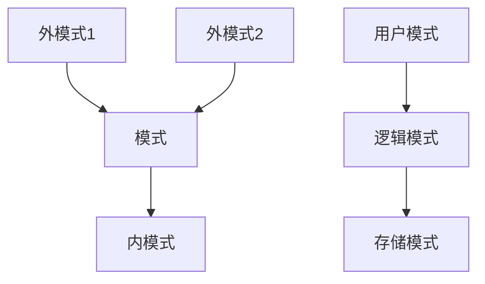

# SQL数据库

[TOC]

## 数据管理技术

### 发展阶段

1. 人工管理阶段
2. 文件系统阶段
3. 电子表格阶段
4. 数据库系统阶段

### 数据库模型发展历史

1. 层次模型：把数据组织成一棵根在上，叶在下的有向树
2. 网状模型：把数据组织成无环有向图
2. 关系模型：把数据组织成表间有冗余列的表
3. 对象-关系模型：用对象的方法组织数据

### 程序与数据的独立性

- 逻辑独立性：应用程序与数据库的逻辑结构相互独立
- 物理独立性：应用程序与存储在磁盘上的数据库中的数据相互独立

- 外模式/模式:逻辑独立性
- 模式/内模式:物理独立性

### DBMS

Database Management System, DBMS提供4方面数据控制功能：

1. Security: 数据的安全性保护
2. Integrity: 数据的完整性检查
3. Concurrency: 并发控制
4. Recovery: 数据库恢复

### DBS结构
DBS(Database System)包括：

1. DB(Database)
2. DBMS
3. AP(Applicatio Programs)

### DBS组成成分

1. 硬件：内存，外存，数据传输率
2. DB
3. 软件：OS，DBMS，以DBMS为核心的应用开发工具，高级语言+编译系统，数据库应用系统
4. 人：数据库管理员，应用程序员，最终用户(临时用户:用SQL访问DBMS 初级用户:用菜单访问DBMS)

## 关系数据模型

### 基本概念

数据模型(Data Model)：是用来**抽象,表示和处理**现实世界中的数据和信息的工具。

数据模型三要求：

- 能比较真实地模拟现实世界
- 容易为人所理解(对用户)
- 便于在计算机上实现(对开发者)

***
对比：
数据结构的三要素：

- 逻辑结构：对数据间关系的描述， 与数据的存储无关， 独立于计算机
- 运算：定义在数据的逻辑结构上， 具体实现在存储结构上的操作要求
- 存储结构：逻辑结构在计算机存储器里的实现， 依赖于计算机
***

数据库的数据模型的三要素：

- 数据结构
- 数据操作
- 数据完整性约束

